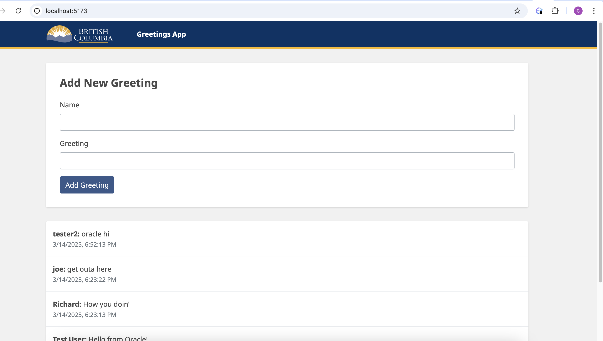

# React Greeting App with Oracle DB

A full-stack web application that demonstrates integration between a React frontend and an Oracle database backend. Users can create and view greetings that are stored in an Oracle database.

## Application Interface

Here's what the running application looks like:



## Project Structure

The project is organized into two main directories:

- `frontend/` - React application built with TypeScript and Vite
- `backend/` - Node.js server with Oracle database integration

## Prerequisites

- Node.js (v18 or higher)
- Oracle Instant Client (v23.3.0 or higher)
- Oracle Database

## Environment Setup

1. Create a `.env` file in the backend directory with the following variables:

```env
ORACLE_USER=system
ORACLE_PASSWORD=your_password
ORACLE_CONNECT_STRING=localhost:1521/FREEPDB1
```

2. Install Oracle Instant Client for your platform (see backend/OracleSetup.md for details)

## Installation

### Backend

```bash
cd backend
npm install
```

### Frontend

```bash
cd frontend/client
npm install
```

## Running the Application

1. Start the backend server:

```bash
cd backend
node server-oracle.js
```

2. Start the frontend development server:

```bash
cd frontend/client
npm run dev
```

The application will be available at:

- Frontend: http://localhost:5173
- Backend API: http://localhost:3001

## Features

- Modern React frontend with TypeScript
- Real-time greeting creation and display
- Oracle database integration for persistent storage
- RESTful API endpoints

## API Endpoints

- GET `/api/greetings` - Retrieve all greetings
- POST `/api/greetings` - Create a new greeting

## Contributing

Pull requests are welcome. For major changes, please open an issue first to discuss what you would like to change.
