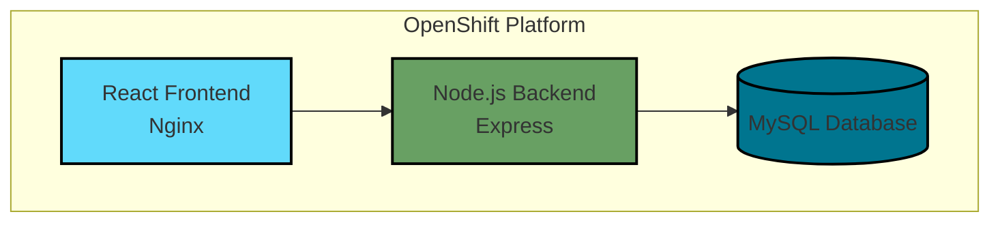

# React Greeting App with MySQL on OpenShift

A React-based greeting application with MySQL backend, designed for deployment on OpenShift. This application allows users to create and view greetings in real-time, demonstrating a full-stack deployment on OpenShift with persistent storage.

## Application Architecture



## Features

- Create and store greetings with names and messages
- Real-time display of greetings in chronological order
- Persistent storage using MySQL database
- Secure communication between components
- OpenShift-native deployment with auto-scaling support

## Project Structure

```
.
├── backend/         # Node.js backend service
├── frontend/        # React frontend application
├── k8s/            # Kubernetes/OpenShift configuration files
│   ├── backend/    # Backend deployment configs
│   ├── frontend/   # Frontend deployment configs
│   └── mysql/      # MySQL deployment configs
└── docs/           # Project documentation
```

## Prerequisites

### Required Tools and Versions

- OpenShift CLI (`oc`) v4.x or higher
- Docker v20.x or higher
- Node.js v18.x or higher
- npm v9.x or higher

### Access Requirements

- Access to BC Government OpenShift cluster
- OpenShift namespace with appropriate roles
- Access to OpenShift's internal registry
- GitHub account with repository access

### Resource Requirements

- Minimum 2 CPU cores available
- Minimum 4GB RAM available
- Minimum 1GB storage for MySQL PVC

## Local Development

### 1. Environment Setup

Create the following `.env` files:

**backend/.env:**

```env
DB_HOST=localhost
DB_USER=greetinguser
DB_PASSWORD=greetingpass
DB_NAME=greeting_db
PORT=3001
```

**frontend/.env:**

```env
REACT_APP_API_URL=http://localhost:3001
PORT=3000
```

### 2. Local MySQL Setup

```bash
# Start MySQL (using Docker)
docker run -d \
  --name mysql-greetings \
  -e MYSQL_ROOT_PASSWORD=rootpass \
  -e MYSQL_DATABASE=greeting_db \
  -e MYSQL_USER=greetinguser \
  -e MYSQL_PASSWORD=greetingpass \
  -p 3306:3306 \
  mysql:8.0

# Create database table
docker exec -i mysql-greetings mysql -ugreetinguser -pgreetingpass greeting_db <<EOF
CREATE TABLE IF NOT EXISTS greetings (
    id INT AUTO_INCREMENT PRIMARY KEY,
    name VARCHAR(255) NOT NULL,
    greeting TEXT NOT NULL,
    created_at TIMESTAMP DEFAULT CURRENT_TIMESTAMP
);
EOF
```

### 3. Backend Setup

```bash
cd backend
npm install
npm test        # Run unit tests
npm run dev     # Start in development mode
npm start       # Start in production mode
```

### 4. Frontend Setup

```bash
cd frontend
npm install
npm test        # Run unit tests
npm run dev     # Start in development mode
npm start       # Start in production mode
```

### Development vs Production

Development Mode:

- Hot reloading enabled
- Detailed error messages
- Debug logging
- CORS allows localhost

Production Mode:

- Optimized builds
- Minimal error details
- Production logging levels
- Strict CORS settings

## OpenShift Deployment Guide

### 1. Login to OpenShift

```bash
# Login to OpenShift cluster
oc login --token=<your-token> --server=https://api.silver.devops.gov.bc.ca:6443

# Switch to your project
oc project 5b7aa5-dev
```

### 2. Deploy MySQL Infrastructure

#### A. Deployment Steps

1. Create the required resources in order:

```bash
# Create secret with MySQL credentials
oc apply -f k8s/mysql/manifests/mysql-secret.yaml

# Create persistent volume claim for MySQL data
oc apply -f k8s/mysql/manifests/mysql-pvc.yaml

# Apply network policy for MySQL security
oc apply -f k8s/mysql/manifests/mysql-greetings.networkpolicy.yaml

# Deploy MySQL and create service
oc apply -f k8s/mysql/manifests/mysql-deployment.yaml
```

2. Verify resources were created:

```bash
# Check all MySQL-related resources
oc get all,secret,pvc,networkpolicy -l app.kubernetes.io/name=mysql-greetings

# Wait for pod to be ready
oc get pods -l app.kubernetes.io/name=mysql-greetings --watch
```

#### B. Connect and Test

1. Get a shell to the MySQL pod:

```bash
# First, get the pod name
oc get pods -l app.kubernetes.io/name=mysql-greetings

# Connect to the pod (replace pod-name with actual pod name)
oc rsh mysql-greetings-xxxxx-xxxxx
```

2. Test MySQL connection using secret credentials:

```bash
# Connect to MySQL inside the pod
mysql -u greetinguser -pgreetingpass greeting_db

# Or connect directly in one command
oc rsh $(oc get pod -l app.kubernetes.io/name=mysql-greetings -o name) mysql -u greetinguser -pgreetingpass greeting_db
```

3. Verify database setup:

```bash
# List all accessible databases
mysql -u greetinguser -pgreetingpass -e "SHOW DATABASES;"

# Expected output:
# +--------------------+
# | Database           |
# +--------------------+
# | greeting_db        |
# | information_schema |
# | performance_schema |
# +--------------------+
```

#### MySQL Configuration

Default development credentials (stored in `mysql-secret.yaml`):

- Database Name: `greeting_db`
- Username: `greetinguser`
- Password: `greetingpass`
- Root Password: `rootpass`

4. Set up the database and table:

```bash
# Get MySQL pod name
POD_NAME=$(oc get pod -l app.kubernetes.io/name=mysql-greetings -o name)

# Create database and table
oc exec -it $POD_NAME -- mysql -u root -prootpass -e "
CREATE DATABASE IF NOT EXISTS greeting_db;
USE greeting_db;
CREATE TABLE IF NOT EXISTS greetings (
    id INT AUTO_INCREMENT PRIMARY KEY,
    name VARCHAR(255) NOT NULL,
    greeting TEXT NOT NULL,
    created_at TIMESTAMP DEFAULT CURRENT_TIMESTAMP
);"

# Grant permissions to application user
oc exec -it $POD_NAME -- mysql -u root -prootpass -e "
GRANT ALL PRIVILEGES ON greeting_db.* TO 'greetinguser'@'%';
FLUSH PRIVILEGES;"

# Verify table creation
oc exec -it $POD_NAME -- mysql -u greetinguser -pgreetingpass -e "USE greeting_db; SHOW TABLES;"
```

**Note:** For production deployment, ensure to:

1. Change these default credentials
2. Use a secure method for managing secrets (e.g., HashiCorp Vault)
3. Consider using higher resource limits

### 3. Deploy Backend API

#### A. Build and Push Image

```bash
# Build backend
docker build -f Dockerfile.backend -t backend:latest .
docker tag backend:latest image-registry.apps.silver.devops.gov.bc.ca/5b7aa5-dev/greeting-backend:latest
docker push image-registry.apps.silver.devops.gov.bc.ca/5b7aa5-dev/greeting-backend:latest
```

#### B. Deploy Resources

```bash
# Apply backend configurations
oc apply -f k8s/backend/manifests/

# Verify deployment
oc get pods,svc,route -l app.kubernetes.io/name=greeting-backend
```

#### C. Environment Variables

The backend service uses the following environment variables:

- `DB_HOST`: MySQL host (default: mysql-greetings)
- `DB_USER`: Database user (from mysql-greetings-secret)
- `DB_PASSWORD`: Database password (from mysql-greetings-secret)
- `DB_NAME`: Database name (from mysql-greetings-secret)
- `PORT`: Backend service port (default: 3001)

#### D. API Endpoints

The backend service exposes the following REST endpoints:

1. **Health Check**

   - Method: `GET`
   - Path: `/`
   - Response: `200 OK`
     ```json
     {
       "status": "ok",
       "timestamp": "ISO-8601 timestamp"
     }
     ```

2. **Create Greeting**

   - Method: `POST`
   - Path: `/api/greetings`
   - Content-Type: `application/json`
   - Request Body:
     ```json
     {
       "name": "string",
       "greeting": "string"
     }
     ```
   - Response: `201 Created`
     ```json
     {
       "id": "number",
       "name": "string",
       "greeting": "string",
       "created_at": "timestamp"
     }
     ```

3. **Get All Greetings**
   - Method: `GET`
   - Path: `/api/greetings`
   - Response: `200 OK`
     ```json
     [
       {
         "id": "number",
         "name": "string",
         "greeting": "string",
         "created_at": "timestamp"
       }
     ]
     ```

#### MySQL Backup and Recovery

1. Create database backup:

```bash
# Get MySQL pod name
POD_NAME=$(oc get pod -l app.kubernetes.io/name=mysql-greetings -o name)

# Create backup
oc exec $POD_NAME -- mysqldump -u root -prootpass greeting_db > backup.sql

# Or backup to compressed file
oc exec $POD_NAME -- mysqldump -u root -prootpass greeting_db | gzip > backup.sql.gz
```

2. Restore from backup:

```bash
# Restore from SQL file
oc exec -i $POD_NAME -- mysql -u root -prootpass greeting_db < backup.sql

# Or restore from compressed file
zcat backup.sql.gz | oc exec -i $POD_NAME -- mysql -u root -prootpass greeting_db
```

#### Frontend Browser Compatibility

The frontend application is compatible with:

- Chrome (latest 2 versions)
- Firefox (latest 2 versions)
- Safari (latest 2 versions)
- Edge (latest 2 versions)

Minimum required screen resolution: 1024x768

#### Monitoring and Logging

1. **OpenShift Monitoring**

   - Resource usage metrics available in OpenShift dashboard
   - CPU, memory, and network usage tracked
   - Pod health status monitoring

2. **Application Logging**

   - Backend logs available via `oc logs deployment/greeting-backend`
   - Frontend logs available via `oc logs deployment/frontend`
   - MySQL logs available via `oc logs deployment/mysql-greetings`

3. **Database Monitoring**
   - Connection pool status
   - Query performance metrics
   - Storage usage tracking

### 4. Deploy Frontend

#### A. Build and Push Image

```bash
# Build frontend
docker build -f Dockerfile.frontend -t frontend:latest .
docker tag frontend:latest image-registry.apps.silver.devops.gov.bc.ca/5b7aa5-dev/greeting-frontend:latest
docker push image-registry.apps.silver.devops.gov.bc.ca/5b7aa5-dev/greeting-frontend:latest
```

#### B. Deploy Resources

```bash
# Apply frontend configurations
oc apply -f k8s/frontend/manifests/

# Verify deployment
oc get pods,svc,route -l app.kubernetes.io/name=frontend
```

#### C. Environment Variables

The frontend service uses the following environment variables:

- `REACT_APP_API_URL`: Backend API URL (default: https://greeting-backend-5b7aa5-dev.apps.silver.devops.gov.bc.ca)
- `PORT`: Frontend service port (default: 8080)
- `NODE_ENV`: Node environment (default: production)

#### D. Application Features

The frontend application provides the following features:

1. **Create Greeting**

   - Form to input name and greeting message
   - Submit button to save the greeting
   - Success/error feedback on submission

2. **View Greetings**
   - List of all greetings in reverse chronological order
   - Each greeting shows:
     - Name of the person
     - Greeting message
     - Creation timestamp
   - Auto-refresh when new greetings are added

#### E. Test Frontend Connection

1. Access the frontend application:

```bash
# Get the frontend route
FRONTEND_URL=$(oc get route frontend -o jsonpath='{.spec.host}')
echo "Frontend URL: https://$FRONTEND_URL"
```

2. Verify the application:
   - Open the URL in a web browser
   - Create a new greeting using the form
   - Verify the greeting appears in the list
   - Check that previously created greetings are visible

### 5. Verify Deployment

```bash
# Check all resources
oc get all

# Check pods status
oc get pods

# Check routes
oc get routes

# Check services
oc get svc
```

### 6. Troubleshooting

```bash
# Check pod logs
oc logs <pod-name>

# Check pod description
oc describe pod <pod-name>

# Check deployment status
oc rollout status deployment/<deployment-name>

# Restart deployments if needed
oc rollout restart deployment/<deployment-name>
```

## Environment Variables

### Frontend

- `REACT_APP_API_URL`: Backend API URL
- `PORT`: Frontend service port (default: 3000)

## Security Considerations

1. All sensitive information is stored in Kubernetes secrets
2. Network policies are in place to restrict pod communication
3. Persistent volumes are used for database storage
4. HTTPS is enabled for external access

## Maintenance

### Updating Dependencies

1. Regularly update npm packages in both frontend and backend
2. Keep Docker base images updated
3. Monitor OpenShift operator versions

### Backup

1. Database backups should be scheduled regularly
2. Configuration files should be version controlled
3. Container images should be tagged and stored in a registry

## Contributing

1. Fork the repository
2. Create a feature branch
3. Commit your changes
4. Push to the branch
5. Create a Pull Request

## License

[Add your license information here]
