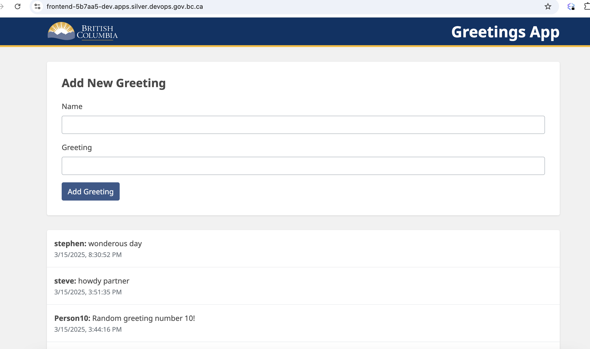
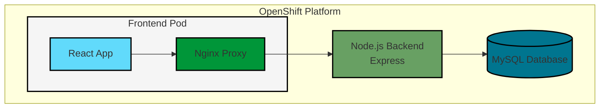

# React Greeting App with MySQL on OpenShift

A React-based greeting application with MySQL backend, designed for deployment on OpenShift. This application allows users to create and view greetings in real-time, demonstrating a full-stack deployment on OpenShift with persistent storage.

## Screenshot



The application features the BC Government standard header design and provides a clean, user-friendly interface with:

- A simple form to add new greetings with name and message fields
- Real-time display of submitted greetings
- Chronological listing with timestamps (e.g. "3/15/2025, 8:30:52 PM")
- Responsive design that works across different devices
- Consistent BC Government branding and styling

## Application Architecture



## Features

- Create and store greetings with names and messages
- Real-time display of greetings in chronological order
- Persistent storage using MySQL database
- Secure communication between components
- OpenShift-native deployment with auto-scaling support

## Project Structure

```
.
├── backend/         # Node.js backend service
├── frontend/        # React frontend application
├── k8s/            # Kubernetes/OpenShift configuration files
│   ├── backend/    # Backend deployment configs
│   ├── frontend/   # Frontend deployment configs
│   └── mysql/      # MySQL deployment configs
└── docs/           # Project documentation
```

## Prerequisites

### Required Tools and Versions

- OpenShift CLI (`oc`) v4.x or higher
- Docker v20.x or higher
- Node.js v18.x or higher
- npm v9.x or higher

### Access Requirements

- Access to BC Government OpenShift cluster
- OpenShift namespace with appropriate roles
- Access to OpenShift's internal registry
- GitHub account with repository access

### Resource Requirements

- Minimum 2 CPU cores available
- Minimum 4GB RAM available
- Minimum 1GB storage for MySQL PVC

## Local Development

### 1. Environment Setup

Create the following `.env` files:

**backend/.env:**

```env
DB_HOST=localhost
DB_USER=greetinguser
DB_PASSWORD=greetingpass
DB_NAME=greeting_db
PORT=3001
```

**frontend/.env:**

```env
REACT_APP_API_URL=http://localhost:3001
PORT=3000
```

### 2. Local MySQL Setup

```bash
# Start MySQL (using Docker)
docker run -d \
  --name mysql-greetings \
  -e MYSQL_ROOT_PASSWORD=rootpass \
  -e MYSQL_DATABASE=greeting_db \
  -e MYSQL_USER=greetinguser \
  -e MYSQL_PASSWORD=greetingpass \
  -p 3306:3306 \
  mysql:8.0

# Create database table
docker exec -i mysql-greetings mysql -ugreetinguser -pgreetingpass greeting_db <<EOF
CREATE TABLE IF NOT EXISTS greetings (
    id INT AUTO_INCREMENT PRIMARY KEY,
    name VARCHAR(255) NOT NULL,
    greeting TEXT NOT NULL,
    created_at TIMESTAMP DEFAULT CURRENT_TIMESTAMP
);
EOF
```

### 3. Backend Setup

```bash
cd backend
npm install
npm test        # Run unit tests
npm run dev     # Start in development mode
npm start       # Start in production mode
```

### 4. Frontend Setup

```bash
cd frontend
npm install
npm test        # Run unit tests
npm run dev     # Start in development mode
npm start       # Start in production mode
```

### Development vs Production

Development Mode:

- Hot reloading enabled
- Detailed error messages
- Debug logging
- CORS allows localhost

Production Mode:

- Optimized builds
- Minimal error details
- Production logging levels
- Strict CORS settings

## OpenShift Deployment Guide

### 1. Login to OpenShift

```bash
# Login to OpenShift cluster
oc login --token=<your-token> --server=https://api.silver.devops.gov.bc.ca:6443

# Switch to your project
oc project 5b7aa5-dev
```

### 2. Deploy MySQL Infrastructure

#### A. Deployment Steps

1. Create the required resources in order:

```bash
# Create secret with MySQL credentials
oc apply -f k8s/mysql/manifests/mysql-secret.yaml

# Create persistent volume claim for MySQL data
oc apply -f k8s/mysql/manifests/mysql-pvc.yaml

# Apply network policy for MySQL security
oc apply -f k8s/mysql/manifests/mysql-greetings.networkpolicy.yaml

# Deploy MySQL and create service
oc apply -f k8s/mysql/manifests/mysql-deployment.yaml
```

2. Verify resources were created:

```bash
# Check all MySQL-related resources
oc get all,secret,pvc,networkpolicy -l app.kubernetes.io/name=mysql-greetings

# Wait for pod to be ready
oc get pods -l app.kubernetes.io/name=mysql-greetings --watch
```

#### B. Connect and Test

1. Get a shell to the MySQL pod:

```bash
# First, get the pod name
oc get pods -l app.kubernetes.io/name=mysql-greetings

# Connect to the pod (replace pod-name with actual pod name)
oc rsh mysql-greetings-xxxxx-xxxxx
```

2. Test MySQL connection using secret credentials:

```bash
# Connect to MySQL inside the pod
mysql -u greetinguser -pgreetingpass greeting_db

# Or connect directly in one command
oc rsh $(oc get pod -l app.kubernetes.io/name=mysql-greetings -o name) mysql -u greetinguser -pgreetingpass greeting_db
```

3. Verify database setup:

```bash
# List all accessible databases
mysql -u greetinguser -pgreetingpass -e "SHOW DATABASES;"

# Expected output:
# +--------------------+
# | Database           |
# +--------------------+
# | greeting_db        |
# | information_schema |
# | performance_schema |
# +--------------------+
```

#### MySQL Configuration

Default development credentials (stored in `mysql-secret.yaml`):

- Database Name: `greeting_db`
- Username: `greetinguser`
- Password: `greetingpass`
- Root Password: `rootpass`

4. Set up the database and table:

```bash
# Get MySQL pod name
POD_NAME=$(oc get pod -l app.kubernetes.io/name=mysql-greetings -o name)

# Create database and table
oc exec -it $POD_NAME -- mysql -u root -prootpass -e "
CREATE DATABASE IF NOT EXISTS greeting_db;
USE greeting_db;
CREATE TABLE IF NOT EXISTS greetings (
    id INT AUTO_INCREMENT PRIMARY KEY,
    name VARCHAR(255) NOT NULL,
    greeting TEXT NOT NULL,
    created_at TIMESTAMP DEFAULT CURRENT_TIMESTAMP
);"

# Grant permissions to application user
oc exec -it $POD_NAME -- mysql -u root -prootpass -e "
GRANT ALL PRIVILEGES ON greeting_db.* TO 'greetinguser'@'%';
FLUSH PRIVILEGES;"

# Verify table creation
oc exec -it $POD_NAME -- mysql -u greetinguser -pgreetingpass -e "USE greeting_db; SHOW TABLES;"
```

**Note:** For production deployment, ensure to:

1. Change these default credentials
2. Use a secure method for managing secrets (e.g., HashiCorp Vault)
3. Consider using higher resource limits

### 3. Deploy Backend API

#### A. Build and Push Image

```bash
# Build backend
docker build -f Dockerfile.backend -t backend:latest .
docker tag backend:latest image-registry.apps.silver.devops.gov.bc.ca/5b7aa5-dev/greeting-backend:latest
docker push image-registry.apps.silver.devops.gov.bc.ca/5b7aa5-dev/greeting-backend:latest
```

#### B. Deploy Resources

```bash
# Apply backend configurations
oc apply -f k8s/backend/manifests/

# Verify deployment
oc get pods,svc,route -l app.kubernetes.io/name=greeting-backend
```

#### C. Environment Variables

The backend service uses the following environment variables:

- `DB_HOST`: MySQL host (default: mysql-greetings)
- `DB_USER`: Database user (from mysql-greetings-secret)
- `DB_PASSWORD`: Database password (from mysql-greetings-secret)
- `DB_NAME`: Database name (from mysql-greetings-secret)
- `PORT`: Backend service port (default: 3001)

#### D. API Endpoints

The backend service exposes the following REST endpoints:

1. **Health Check**

   - Method: `GET`
   - Path: `/`
   - Response: `200 OK`
     ```json
     {
       "status": "ok",
       "timestamp": "ISO-8601 timestamp"
     }
     ```

2. **Create Greeting**

   - Method: `POST`
   - Path: `/api/greetings`
   - Content-Type: `application/json`
   - Request Body:
     ```json
     {
       "name": "string",
       "greeting": "string"
     }
     ```
   - Response: `201 Created`
     ```json
     {
       "id": "number",
       "name": "string",
       "greeting": "string",
       "created_at": "timestamp"
     }
     ```

3. **Get All Greetings**
   - Method: `GET`
   - Path: `/api/greetings`
   - Response: `200 OK`
     ```json
     [
       {
         "id": "number",
         "name": "string",
         "greeting": "string",
         "created_at": "timestamp"
       }
     ]
     ```

#### MySQL Backup and Recovery

1. Create database backup:

```bash
# Get MySQL pod name
POD_NAME=$(oc get pod -l app.kubernetes.io/name=mysql-greetings -o name)

# Create backup
oc exec $POD_NAME -- mysqldump -u root -prootpass greeting_db > backup.sql

# Or backup to compressed file
oc exec $POD_NAME -- mysqldump -u root -prootpass greeting_db | gzip > backup.sql.gz
```

2. Restore from backup:

```bash
# Restore from SQL file
oc exec -i $POD_NAME -- mysql -u root -prootpass greeting_db < backup.sql

# Or restore from compressed file
zcat backup.sql.gz | oc exec -i $POD_NAME -- mysql -u root -prootpass greeting_db
```

#### Frontend Browser Compatibility

The frontend application is compatible with:

- Chrome (latest 2 versions)
- Firefox (latest 2 versions)
- Safari (latest 2 versions)
- Edge (latest 2 versions)

Minimum required screen resolution: 1024x768

#### Monitoring and Logging

1. **OpenShift Monitoring**

   - Resource usage metrics available in OpenShift dashboard
   - CPU, memory, and network usage tracked
   - Pod health status monitoring

2. **Application Logging**

   - Backend logs available via `oc logs deployment/greeting-backend`
   - Frontend logs available via `oc logs deployment/frontend`
   - MySQL logs available via `oc logs deployment/mysql-greetings`

3. **Database Monitoring**
   - Connection pool status
   - Query performance metrics
   - Storage usage tracking

### 4. Deploy Frontend

#### A. Build and Push Image

```bash
# Build frontend
docker build -f Dockerfile.frontend -t frontend:latest .
docker tag frontend:latest image-registry.apps.silver.devops.gov.bc.ca/5b7aa5-dev/greeting-frontend:latest
docker push image-registry.apps.silver.devops.gov.bc.ca/5b7aa5-dev/greeting-frontend:latest
```

#### B. Deploy Resources

```bash
# Apply frontend configurations
oc apply -f k8s/frontend/manifests/

# Verify deployment
oc get pods,svc,route -l app.kubernetes.io/name=frontend
```

#### C. Environment Variables

The frontend service uses the following environment variables:

- `REACT_APP_API_URL`: Backend API URL (default: https://greeting-backend-5b7aa5-dev.apps.silver.devops.gov.bc.ca)
- `PORT`: Frontend service port (default: 8080)
- `NODE_ENV`: Node environment (default: production)

#### D. Application Features

The frontend application provides the following features:

1. **Create Greeting**

   - Form to input name and greeting message
   - Submit button to save the greeting
   - Success/error feedback on submission

2. **View Greetings**
   - List of all greetings in reverse chronological order
   - Each greeting shows:
     - Name of the person
     - Greeting message
     - Creation timestamp
   - Auto-refresh when new greetings are added

#### E. Test Frontend Connection

1. Access the frontend application:

```bash
# Get the frontend route
FRONTEND_URL=$(oc get route frontend -o jsonpath='{.spec.host}')
echo "Frontend URL: https://$FRONTEND_URL"
```

2. Verify the application:
   - Open the URL in a web browser
   - Create a new greeting using the form
   - Verify the greeting appears in the list
   - Check that previously created greetings are visible

### 5. Verify Deployment

```bash
# Check all resources
oc get all

# Check pods status
oc get pods

# Check routes
oc get routes

# Check services
oc get svc
```

### 6. Troubleshooting

```bash
# Check pod logs
oc logs <pod-name>

# Check pod description
oc describe pod <pod-name>

# Check deployment status
oc rollout status deployment/<deployment-name>

# Restart deployments if needed
oc rollout restart deployment/<deployment-name>
```

### Testing Backend Connectivity

When the backend route is not exposed or you need to verify internal service communication, you can test the backend service directly from the frontend pod:

```bash
# Get the frontend pod name
FRONTEND_POD=$(oc get pod -l app=frontend -o jsonpath='{.items[0].metadata.name}')

# Test the backend service using curl from the frontend pod
oc exec -it $FRONTEND_POD -- curl -v http://greeting-backend.5b7aa5-dev.svc.cluster.local:3001/api/greetings

# Expected successful response will return a JSON array of greetings
```

This test helps verify:

- DNS resolution of the backend service
- Network connectivity between frontend and backend
- Backend service functionality
- Proper configuration of the service endpoint

If this test succeeds but the frontend application cannot connect, check the Nginx configuration in the frontend ConfigMap.

## Troubleshooting Guide

### Frontend Nginx Proxy Issues

If you encounter issues with the frontend pod unable to connect to the backend service, particularly with DNS resolution errors like "host not found in upstream", follow these troubleshooting steps:

1. Check Pod Status and Logs:

```bash
# Get frontend pod status
oc get pods | grep frontend

# Check pod logs for specific errors
oc logs <frontend-pod-name>
```

2. DNS Resolution Issues:

   - If you see errors like "host not found in upstream 'greeting-backend'", this indicates DNS resolution problems
   - Try these solutions in order:

   a. Use Full DNS Name:

   ```nginx
   location /api/ {
       resolver 10.96.0.10 valid=10s;
       proxy_pass http://greeting-backend.5b7aa5-dev.svc.cluster.local:3001;
   }
   ```

   b. Use Service ClusterIP (temporary solution):

   ```nginx
   location /api/ {
       proxy_pass http://<service-cluster-ip>:3001;
   }
   ```

3. Test Backend Connectivity:

   - Test the connection from within the frontend pod:

   ```bash
   # Test API endpoint through Nginx
   oc exec <frontend-pod-name> -- curl -v http://localhost:8080/api/greetings

   # Get backend service details
   oc get svc greeting-backend
   ```

4. Common Solutions:
   - Verify the backend service exists and has endpoints
   - Check network policies allow communication between frontend and backend
   - Ensure the backend service port matches the proxy_pass port
   - Verify the backend service is in the same namespace

Remember: Using ClusterIP directly in the Nginx configuration is not recommended for production as it bypasses Kubernetes service discovery, but it can be useful for temporary troubleshooting.

## Environment Variables

### Frontend

- `REACT_APP_API_URL`: Backend API URL
- `PORT`: Frontend service port (default: 3000)

## Troubleshooting Guide

### Frontend Nginx Proxy Issues

If you encounter issues with the frontend pod unable to connect to the backend service, particularly with DNS resolution errors like "host not found in upstream", follow these troubleshooting steps:

1. Check Pod Status and Logs:

```bash
# Get frontend pod status
oc get pods | grep frontend

# Check pod logs for specific errors
oc logs <frontend-pod-name>
```

2. DNS Resolution Issues:

   - If you see errors like "host not found in upstream 'greeting-backend'", this indicates DNS resolution problems
   - Try these solutions in order:

   a. Use Full DNS Name:

   ```nginx
   location /api/ {
       resolver 10.96.0.10 valid=10s;
       proxy_pass http://greeting-backend.5b7aa5-dev.svc.cluster.local:3001;
   }
   ```

   b. Use Service ClusterIP (temporary solution):

   ```nginx
   location /api/ {
       proxy_pass http://<service-cluster-ip>:3001;
   }
   ```

3. Test Backend Connectivity:

   - Test the connection from within the frontend pod:

   ```bash
   # Test API endpoint through Nginx
   oc exec <frontend-pod-name> -- curl -v http://localhost:8080/api/greetings

   # Get backend service details
   oc get svc greeting-backend
   ```

4. Common Solutions:
   - Verify the backend service exists and has endpoints
   - Check network policies allow communication between frontend and backend
   - Ensure the backend service port matches the proxy_pass port
   - Verify the backend service is in the same namespace

Remember: Using ClusterIP directly in the Nginx configuration is not recommended for production as it bypasses Kubernetes service discovery, but it can be useful for temporary troubleshooting.

## Security Considerations

1. All sensitive information is stored in Kubernetes secrets
2. Network policies are in place to restrict pod communication
3. Persistent volumes are used for database storage
4. HTTPS is enabled for external access

## Maintenance

### Updating Dependencies

1. Regularly update npm packages in both frontend and backend
2. Keep Docker base images updated
3. Monitor OpenShift operator versions

### Backup

1. Database backups should be scheduled regularly
2. Configuration files should be version controlled
3. Container images should be tagged and stored in a registry

## Contributing

1. Fork the repository
2. Create a feature branch
3. Commit your changes
4. Push to the branch
5. Create a Pull Request

## License

[Add your license information here]

### Nginx Configuration and Testing

The frontend uses Nginx as a reverse proxy to handle API requests and serve static files. The configuration is managed through a ConfigMap in `k8s/frontend/manifests/nginx-config.yaml`.

#### Key Configuration Areas

1. **Static File Serving**:

```nginx
location / {
    try_files $uri /index.html;
    add_header Cache-Control "no-store, no-cache, must-revalidate";
}
```

2. **API Proxy Configuration**:

```nginx
location /api/ {
    rewrite ^/api/(.*) /api/$1 break;
    proxy_pass http://greeting-backend:3001;
    proxy_http_version 1.1;
    proxy_set_header Upgrade $http_upgrade;
    proxy_set_header Connection 'upgrade';
    proxy_set_header Host $host;
    proxy_cache_bypass $http_upgrade;
}
```

3. **CORS Headers**:

```nginx
add_header 'Access-Control-Allow-Origin' '*' always;
add_header 'Access-Control-Allow-Methods' 'GET, POST, OPTIONS, PUT, DELETE' always;
add_header 'Access-Control-Allow-Headers' 'DNT,User-Agent,X-Requested-With,If-Modified-Since,Cache-Control,Content-Type,Range,Authorization' always;
```

#### Testing Nginx Configuration

1. **Verify Configuration Syntax**:

```bash
# Get frontend pod name
FRONTEND_POD=$(oc get pod -l app=frontend -o jsonpath='{.items[0].metadata.name}')

# Check Nginx configuration
oc exec $FRONTEND_POD -- nginx -t
```

2. **Test Static File Serving**:

```bash
# Test index.html
oc exec $FRONTEND_POD -- curl -I http://localhost:8080/

# Test static asset (replace with actual asset path)
oc exec $FRONTEND_POD -- curl -I http://localhost:8080/static/js/main.js
```

3. **Test API Proxying**:

```bash
# Test API endpoint through Nginx
oc exec $FRONTEND_POD -- curl -v http://localhost:8080/api/greetings

# Test API endpoint directly (bypass Nginx)
oc exec $FRONTEND_POD -- curl -v http://greeting-backend:3001/api/greetings
```

4. **Test CORS Headers**:

```bash
# Test OPTIONS request (CORS preflight)
oc exec $FRONTEND_POD -- curl -X OPTIONS -I http://localhost:8080/api/greetings \
  -H 'Origin: http://example.com' \
  -H 'Access-Control-Request-Method: POST'
```

#### Common Nginx Issues and Solutions

1. **502 Bad Gateway**:

   - Check if backend service is running: `oc get pods -l app=greeting-backend`
   - Verify service DNS resolution: `oc exec $FRONTEND_POD -- nslookup greeting-backend`
   - Check backend service port matches proxy_pass

2. **504 Gateway Timeout**:

   - Increase proxy timeout settings:

   ```nginx
   proxy_connect_timeout 60s;
   proxy_send_timeout 60s;
   proxy_read_timeout 60s;
   ```

3. **DNS Resolution Issues**:

   - Use full service DNS name: `greeting-backend.5b7aa5-dev.svc.cluster.local`
   - Add resolver directive: `resolver kube-dns.kube-system.svc.cluster.local valid=10s;`
   - Temporarily use ClusterIP (not recommended for production)

4. **CORS Issues**:
   - Verify CORS headers in response: `curl -v -H "Origin: http://example.com" http://localhost:8080/api/greetings`
   - Check if headers are added for all response codes
   - Ensure OPTIONS requests are handled correctly

#### Nginx Logging and Debugging

1. **Access Logs**:

```bash
# View access logs
oc exec $FRONTEND_POD -- tail -f /var/log/nginx/access.log
```

2. **Error Logs**:

```bash
# View error logs
oc exec $FRONTEND_POD -- tail -f /var/log/nginx/error.log
```

3. **Debug Mode**:

   - Enable debug logging in nginx.conf:

   ```nginx
   error_log /var/log/nginx/error.log debug;
   ```

4. **Request Tracing**:
   - Add request ID tracking:
   ```nginx
   add_header X-Request-ID $request_id;
   proxy_set_header X-Request-ID $request_id;
   ```

Remember to restart Nginx after configuration changes:

```bash
oc exec $FRONTEND_POD -- nginx -s reload
```

## GitHub Workflow

### Pushing Updates

1. **Update Local Repository**:

```bash
# Ensure you're on the main branch
git checkout main

# Pull latest changes
git pull origin main

# Create a feature branch
git checkout -b feature/your-feature-name
```

2. **Make and Test Changes**:

```bash
# Stage changes
git add .

# Create a descriptive commit
git commit -m "feat: description of your changes"
```

3. **Update OpenShift Configurations**:

   - If you've modified Kubernetes/OpenShift configurations:

   ```bash
   # Test configurations locally
   oc apply --dry-run=client -f k8s/frontend/manifests/
   oc apply --dry-run=client -f k8s/backend/manifests/
   ```

4. **Push Changes**:

```bash
# Push your feature branch
git push origin feature/your-feature-name
```

5. **Create Pull Request**:

   - Go to GitHub repository
   - Click "Compare & pull request"
   - Fill in PR template:

     ```markdown
     ## Description

     Brief description of changes

     ## Type of Change

     - [ ] Bug fix
     - [ ] New feature
     - [ ] Configuration update
     - [ ] Documentation update

     ## Testing

     - [ ] Unit tests updated
     - [ ] Integration tests updated
     - [ ] Manual testing performed

     ## OpenShift Impact

     - [ ] Deployment changes
     - [ ] Configuration changes
     - [ ] Resource requirements changes
     ```

### Version Control Best Practices

1. **Commit Messages**:

   - Use conventional commits format:
     ```
     feat: add new feature
     fix: resolve bug
     docs: update documentation
     chore: update dependencies
     refactor: code improvements
     test: add or modify tests
     ```

2. **Branch Strategy**:

   - `main`: Production-ready code
   - `feature/*`: New features
   - `fix/*`: Bug fixes
   - `docs/*`: Documentation updates
   - `release/*`: Release preparation

3. **Code Review Guidelines**:

   - Review OpenShift configurations carefully
   - Check for sensitive information
   - Verify environment variables
   - Ensure documentation is updated
   - Test deployment steps

4. **Post-Merge Actions**:

```bash
# Switch back to main
git checkout main

# Pull merged changes
git pull origin main

# Delete local feature branch
git branch -d feature/your-feature-name

# Delete remote feature branch (optional)
git push origin --delete feature/your-feature-name
```

### Deployment After Push

1. **Build and Push Images**:

```bash
# Build and push frontend
docker build -f Dockerfile.frontend -t frontend:latest .
docker tag frontend:latest image-registry.apps.silver.devops.gov.bc.ca/5b7aa5-dev/greeting-frontend:latest
docker push image-registry.apps.silver.devops.gov.bc.ca/5b7aa5-dev/greeting-frontend:latest

# Build and push backend
docker build -f Dockerfile.backend -t backend:latest .
docker tag backend:latest image-registry.apps.silver.devops.gov.bc.ca/5b7aa5-dev/greeting-backend:latest
docker push image-registry.apps.silver.devops.gov.bc.ca/5b7aa5-dev/greeting-backend:latest
```

2. **Apply Configuration Changes**:

```bash
# Apply backend changes
oc apply -f k8s/backend/manifests/

# Apply frontend changes
oc apply -f k8s/frontend/manifests/

# Restart deployments if needed
oc rollout restart deployment/frontend
oc rollout restart deployment/greeting-backend
```

3. **Verify Deployment**:

```bash
# Check pod status
oc get pods

# Check logs for errors
oc logs deployment/frontend
oc logs deployment/greeting-backend

# Test the application
curl -v https://$(oc get route frontend -o jsonpath='{.spec.host}')/api/greetings
```
